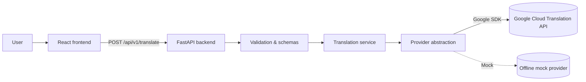

<div align="center">

# Language Translation Tool

**A production-quality, full-stack language translation application** built with
React + TypeScript + FastAPI, powered by the **Google Cloud Translation API**.


</div>

---

## Overview

Language Translation Tool is a clean, modern web application that translates
text between 22 languages. Users type or paste text, choose a source and target
language, and receive the translation instantly with one-click copy and
text-to-speech playback.

Beyond the UI, this repository demonstrates **production-grade AI engineering
practices** around a third-party translation model:

- Clean, layered architecture with a **provider abstraction**, so the Google
  Cloud Translation API is only one of several swappable backends.
- A **typed FastAPI** backend that validates every request, enforces a
  translation budget (`MAX_TEXT_LENGTH`), applies per-client **rate limiting**,
  and returns a uniform, machine-readable error envelope.
- **Secure secrets handling** - API credentials live **only** on the backend in
  environment variables, never in client-side code.
- Meaningful **pytest** and **Vitest** test suites covering happy paths, input
  edge cases, provider failures, timeouts, auth errors, rate limits, and more.

It is a thoughtful, portfolio-ready base that can be extended toward a
multi-provider translation platform.

---

## Features

- 22 supported languages with source/target selectors
- One-click **swap** of source and target languages
- Text input with live **character count** and 5,000-character limit
- **Loading state** while the translation is in flight
- Clear **result card** with the translated text
- One-click **copy to clipboard** (with fallback for older browsers)
- **Text-to-speech** (browser `speechSynthesis`) for the translated text
- Keyboard shortcut: **Ctrl/Cmd + Enter** to translate
- Graceful handling of empty/whitespace input, unsupported languages,
  same-language pairs, provider failures, timeouts, rate limits and network errors
- Responsive, accessible layout (desktop + mobile), skip-link-free but with
  labelled controls, ARIA roles and focus rings
- **Offline mock provider** mode so the app runs with zero credentials
- Structured logging with request correlation IDs; health checks; uniform error codes
- Interactive API docs at `/docs` (OpenAPI/Swagger)

---

## Architecture

```
┌──────────────┐     POST /api/v1/translate      ┌──────────────────────┐
│   Browser    │ ───────────────────────────────▶│    FastAPI Backend   │
│  React + TS  │ ◀───────────────────────────────│  uvicorn app.main:app│
└──────────────┘    JSON response                └──────────┬───────────┘
                                                           │
                                               ┌───────────▼───────────┐
                                               │   Validation + Schemas │
                                               │   (pydantic, HTTP 422) │
                                               └───────────┬───────────┘
                                                           │
                                               ┌───────────▼───────────┐
                                               │   TranslationService   │
                                               │  (logs, same-language  │
                                               │   guard, timeouts)     │
                                               └───────────┬───────────┘
                                                           │
                                               ┌───────────▼───────────┐
                                               │   TranslationProvider  │
                                               │   (abstraction)        │
                                               └───────────┬───────────┘
                                                           │
                                          HTTP/2 (gRPC)     │   Application
                                          via Cloud SDK     │   Default Auth
                                               ┌───────────▼───────────┐
                                               │  Google Cloud          │
                                               │  Translation API (v3)  │
                                               └───────────────────────┘
```



**Data flow:** the browser never talks to Google. It POSTs JSON to our
backend, which validates it (422 on bad input), rejects identical
source/target pairs (400), enforces per-IP rate limits (429), calls the active
provider through a seam (`TranslationProvider`), normalises the result, and
returns a clean JSON payload. Failures surface as stable `code` strings the UI
can render with tailored guidance.

---

## Tech Stack

| Layer     | Technology |
|-----------|------------|
| Frontend  | React 18, TypeScript 5, Vite, Tailwind CSS 3, Vitest + Testing Library |
| Backend   | Python 3.10+, FastAPI, Pydantic v2 / pydantic-settings, uvicorn |
| Translation | Google Cloud Translation API v3 (`google-cloud-translate`) |
| Testing   | pytest (backend), Vitest (frontend) |
| Tooling   | Git + GitHub, `.env` secrets, `requirements.txt`, `package.json` |

---

## Project Structure

```
language-translation-tool/
├── frontend/                      # React + TypeScript + Tailwind SPA
│   ├── public/
│   │   └── favicon.svg
│   ├── src/
│   │   ├── components/            # LanguageSelect, InputPanel, ResultCard, ...
│   │   ├── hooks/                 # useTranslation, useSpeechSynthesis
│   │   ├── services/              # API client, language catalogue
│   │   ├── types/                 # Request/response contracts
│   │   ├── test/                  # Vitest setup
│   │   ├── __tests__/             # Vitest test suites
│   │   ├── App.tsx
│   │   ├── main.tsx
│   │   └── index.css
│   ├── package.json
│   ├── vite.config.ts
│   ├── tailwind.config.js
│   └── .env.example
│
├── backend/                       # FastAPI application
│   ├── app/
│   │   ├── api/
│   │   │   ├── deps.py            # dependency injection
│   │   │   └── v1/
│   │   │       ├── endpoints/     # /health, /translate
│   │   │       └── router.py
│   │   ├── config/
│   │   │   └── settings.py        # environment-driven settings (pydantic-settings)
│   │   ├── core/
│   │   │   ├── exceptions.py      # domain errors + HTTP mapping
│   │   │   ├── logging.py
│   │   │   ├── middleware.py      # correlation ID + rate limiting
│   │   │   └── rate_limit.py      # sliding-window limiter
│   │   ├── schemas/
│   │   │   └── translation.py     # request/response/error schemas
│   │   ├── services/
│   │   │   ├── providers/         # base + google + mock providers
│   │   │   ├── languages.py       # supported language catalogue
│   │   │   └── translation_service.py
│   │   └── main.py                # app factory + entrypoint
│   ├── tests/                     # pytest suite
│   ├── requirements.txt
│   ├── requirements-dev.txt
│   ├── pyproject.toml             # pytest configuration
│   └── .env.example
│
├── .gitignore
├── .env.example                   # root documentation of all env vars
├── CONTRIBUTING.md
├── SECURITY.md
├── CODE_OF_CONDUCT.md
├── LICENSE                        # MIT
└── README.md
```

> **Note on `models/`:** the MVP has no persistence, so input/output *models*
> live in `app/schemas/`. When history or user accounts are added, DB models
> would go in a new `app/models/` package.

---

## Installation

### Prerequisites

- Python **3.10+** (recommended 3.11+; the test suite was run on 3.13)
- Node.js **18+** (recommended 20+) and npm
- (Optional) A Google Cloud project with the
  [Cloud Translation API](https://cloud.google.com/translate) enabled

### 1. Clone and enter the repo

```bash
git clone https://github.com/your-username/language-translation-tool.git
cd language-translation-tool
```

### 2. Backend

```bash
cd backend
python -m venv .venv

# macOS / Linux
source .venv/bin/activate
# Windows
.venv\Scripts\activate

pip install -r requirements-dev.txt
cp .env.example .env        # then edit it (see Environment Variables)
```

### 3. Frontend

```bash
cd ../frontend
npm install
cp .env.example .env        # optional - only needed to override the API URL
```

---

## Environment Variables

Backend variables are read from `backend/.env` (see
[`backend/.env.example`](backend/.env.example)). Frontend variables are read
from `frontend/.env` (see [`frontend/.env.example`](frontend/.env.example)).
A root-level [`.env.example`](.env.example) documents everything in one place.

### Translation provider

| Variable | Values | Notes |
|----------|--------|-------|
| `TRANSLATION_PROVIDER` | `google` \| `mock` | `mock` runs offline with canned answers - no credentials needed. |
| `GOOGLE_CLOUD_PROJECT` | e.g. `my-gcp-project` | Required when using `google`. |
| `GOOGLE_APPLICATION_CREDENTIALS` | path to `service-account.json` | Google Application Default Credentials. |
| `TRANSLATION_LOCATION` | `global` | Defaults to `global`. |
| `TRANSLATE_TIMEOUT_SECONDS` | `10.0` | Per-call provider timeout. |

Alternatively to `GOOGLE_APPLICATION_CREDENTIALS`, authenticate your shell
once with `gcloud auth application-default login`.

### Application behaviour

| Variable | Default | Notes |
|----------|---------|-------|
| `MAX_TEXT_LENGTH` | `5000` | Maximum input length (backend enforces it). |
| `CORS_ORIGINS` | `http://localhost:5173,...` | Comma-separated browser origins. |
| `RATE_LIMIT_REQUESTS` | `60` | Requests allowed per client per window. |
| `RATE_LIMIT_WINDOW_SECONDS` | `60` | Sliding window for the limiter. |
| `ENVIRONMENT` / `DEBUG` / `LOG_LEVEL` | dev / false / INFO | Runtime controls. |

Frontend: `VITE_API_BASE_URL` (optional). Leave empty in dev to use the Vite
proxy; only `VITE_`-prefixed vars reach the browser, so **never** put keys here.

**Security rule of thumb:** Google credentials are read exclusively by the
backend. Nothing secret is ever returned to or bundled into the frontend.

---

## Running the Application

Start the backend (from `backend/`):

```bash
uvicorn app.main:app --reload --port 8000
```

Start the frontend (from `frontend/`, in a second terminal):

```bash
npm run dev        # http://localhost:5173
```

The Vite dev server proxies `/api` to `http://127.0.0.1:8000`, so the browser
is same-origin and CORS configuration is only needed for separate hosts.

Quick sanity check while both are running:

```bash
curl http://127.0.0.1:8000/api/v1/health
curl -X POST http://127.0.0.1:8000/api/v1/translate \
  -H "Content-Type: application/json" \
  -d '{"text":"Hello, how are you?","source_language":"en","target_language":"fr"}'
```

With `TRANSLATION_PROVIDER=mock`, the app works end-to-end offline.

---

## API Documentation

Interactive OpenAPI docs are served by the backend at
[http://127.0.0.1:8000/docs](http://127.0.0.1:8000/docs).

### `GET /api/v1/health`

Returns service status, version and the active provider.

```json
{ "status": "ok", "version": "1.0.0", "provider": "google" }
```

### `POST /api/v1/translate`

Translates `text` from `source_language` to `target_language`.

**Request**

```json
{
  "text": "Hello, how are you?",
  "source_language": "en",
  "target_language": "fr"
}
```

**Response `200 OK`**

```json
{
  "translated_text": "Bonjour, comment allez-vous ?",
  "source_language": "en",
  "target_language": "fr",
  "detected_language": null
}
```

**Errors** - all follow a uniform envelope `{"detail": {"code", "message"}}`:

| HTTP | `code` | Meaning |
|------|--------|---------|
| 400  | `same_language` | Source and target are identical. |
| 422  | `validation_error` | Missing/empty text, unsupported language, text too long. |
| 429  | `rate_limited` | Client exceeded the request budget. |
| 429  | `provider_rate_limit` | Translation provider is throttling. |
| 502  | `provider_authentication_error` | Backend credentials rejected. |
| 502  | `invalid_provider_response` | Provider returned malformed data. |
| 503  | `provider_unavailable` | Provider is down. |
| 504  | `provider_timeout` | Provider exceeded the timeout. |

---

## Testing

### Backend (pytest)

```bash
cd backend
pytest                      # run all tests
pytest -v                   # verbose
pytest --cov=app --cov-report=term-missing   # coverage
```

The suite never calls the network: the Google provider is mocked and the app
is exercised through the offline mock provider plus deterministic fakes.

### Frontend (Vitest)

```bash
cd frontend
npm test                    # run once
npm run test:watch          # watch mode
npm run typecheck           # TypeScript strict check
npm run build               # production build (tsc + vite)
```

---

## Security

- **No secrets in the repo.** `.env`, `.env.*` and all build/venv artifacts are
  git-ignored; only `.env.example` templates are tracked.
- **API key isolation.** Google credentials are read only by the backend from
  environment variables / Application Default Credentials. They are never
  bundled into the frontend and never appear in logs or API responses.
- **Input validation.** All user input is validated (non-empty, length-capped,
  language-whitelist) and normalized before any provider call.
- **Sanitised errors.** Provider error internals are logged for debugging but
  replaced with generic, code-based messages at the edge - see
  `app/core/exceptions.py` and the tests asserting nothing leaks.
- **Rate limiting.** Per-client sliding-window limiter returns `429` with
  `Retry-After`. Swap for a Redis-backed limiter in multi-instance deploys.
- **CORS.** Only the configured origins are allowed to call the API.
- **Logging hygiene.** Logs carry routing metadata and correlation IDs, but
  never the text content sent for translation or any credentials.
- **Dependency hygiene.** Test/dev dependencies are kept separate from runtime
  dependencies.

See [SECURITY.md](SECURITY.md) for reporting vulnerabilities.

---

## Future Improvements

Short-list of realistic, well-scoped next steps:

- **Translation history** - persist recent translations (SQLite/Postgres) in a
  new `app/models/` layer.
- **Multiple providers** - add `Azure`/`DeepL` implementations of
  `TranslationProvider` with provider selection and automatic fallback.
- **Automatic language detection** - let `source_language` be optional and use
  the provider's detection endpoint.
- **Speech-to-text input** - `MediaRecorder` + Web Speech API on the frontend.
- **Streaming translation** - translate long documents asynchronously with
  status polling or WebSockets.
- **User accounts** - auth (OAuth/JWT), quotas, saved preferences.
- **Translation quality evaluation** - BLEU/COMET-style scoring for AB tests.
- **Caching** - memoise repeated `(text, source, target)` requests.
- **Redis-based rate limiting** - shared limiter for multi-instance deploys.
- **Docker deployment** - `Dockerfile`s for backend/frontend + `docker-compose`.
- **CI/CD** - GitHub Actions running both test suites, typecheck and build.
- **Cloud deployment** - GCP Cloud Run / Vercel with managed secrets.
- **Monitoring & observability** - structured JSON logs, Prometheus metrics,
  tracing.

---

## Contributing

Contributions are welcome! Please read
[CONTRIBUTING.md](CONTRIBUTING.md) and the
[Code of Conduct](CODE_OF_CONDUCT.md), then open an issue or a pull request.

---

## License

Distributed under the **MIT License**. See [LICENSE](LICENSE).